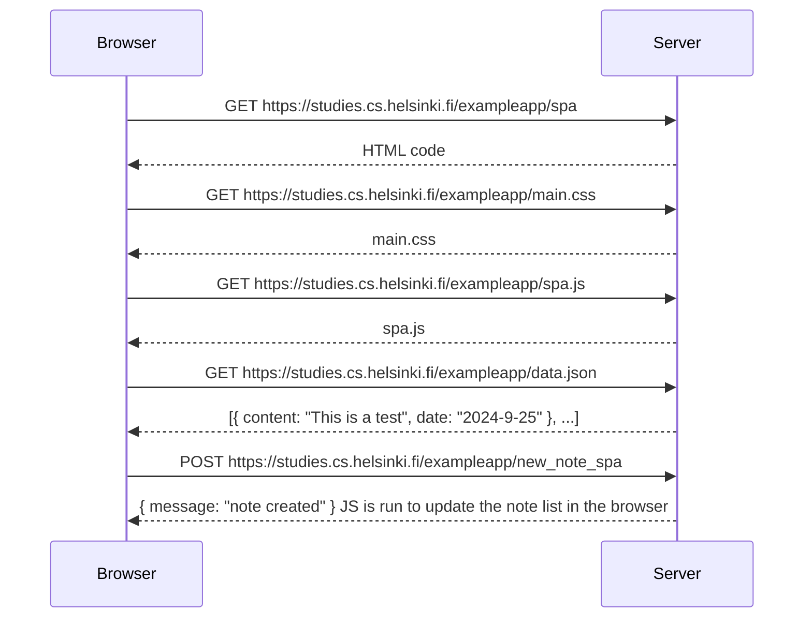

```mermaid

sequenceDiagram
    Browser ->> Server: GET https://studies.cs.helsinki.fi/exampleapp/spa
    Server -->> Browser: HTML code
    Browser ->> Server: GET https://studies.cs.helsinki.fi/exampleapp/main.css
    Server -->> Browser: main.css
    Browser ->> Server: GET https://studies.cs.helsinki.fi/exampleapp/spa.js
    Server -->> Browser: spa.js
    Browser ->> Server: GET https://studies.cs.helsinki.fi/exampleapp/data.json
    Server -->> Browser: [{ content: "This is a test", date: "2024-9-25" }, ...]
    Browser ->> Server: POST https://studies.cs.helsinki.fi/exampleapp/new_note_spa
    Server -->> Browser: { message: "note created" } JS is run to update the note list in the browser

    


    
```
